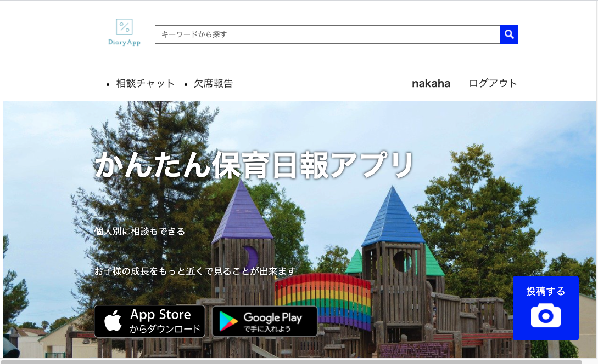

<h2 align="center">Diayr App</h2>

# アプリケーションの概要
保育園での保護者に当てた日報を確認・相談が行えるアプリケーション。個人ノートなどの紙媒体でなく各デバイスで行えるようにする。

# アプリケーションの利用方法
アプリケーションを起動するとログイン画面が表示される。また、当日朝に園児の出欠の確認を取とる。出席・欠席・その他の項目を設ける。ログイン後は保育園からの日報を確認することができる。相談事がある場合はチャットルームを作成し個別に相談できるようになっている。

## 🌐 App URL

### **hhttp://35.73.107.204/**  

# テーブル設計

## users テーブル

| Column                  | Type   | Options                  |
| ----------------------- | ------ | ------------------------ |
| child_nickname          | string | null: false              |
| encrypted_password      | string | null: false              |
| email                   | string | null: false, unique:true |
| last_name               | string | null: false              |
| first_name              | string | null: false              |
| last_name_kana          | string | null: false              |
| first_name_kana         | string | null: false              |
| parent_name             | string | null: false              |

### Association

- has_many :rooms
- has_many :comments
- has_many :messages
- has_many : attendances

## rooms テーブル

| Column   | Type   | Options     |
| -------  | -----  | ----------  |
| name     | string | null: false |

###Association

- has_many :room_users
- has_many :rooms, through: room_users
- has_many :message

## room_users テーブル

| Column   | Type       | Options                        |
| -------- | ---------- | ------------------------------ |
| user     | references | null: false, foreign_key: true |
| room     | references | null: false, foreign_key: true |

###Association

belongs_to :room
belongs_to :user 

## messages テーブル

| Column   | Type       | Options                        |
| -------- | ---------- | ------------------------------ |
| content  | string     |                                |
| user     | references | null: false, foreign_key: true |
| room     | references | null: false, foreign_key: true |

## comments テーブル

| Column      | Type       | Options                      |
| ----------- | ---------- | ---------------------------- |
| text        | text       | null: false                  |
| user        | references | foreign_key: true            |
| message     | references | foreign_key: true            |

### Association

- belongs_to :message
- belongs_to :user

## attendances テーブル

| Column     | Type       | Options      |
| ---------- | ---------- | ------------ |
| attendance | integer    | null: false  |
| text       | string     |              |

### Association

- belongs_to :user
